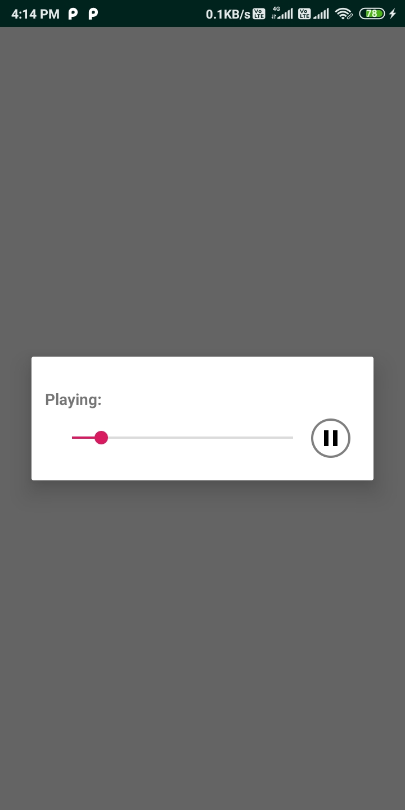
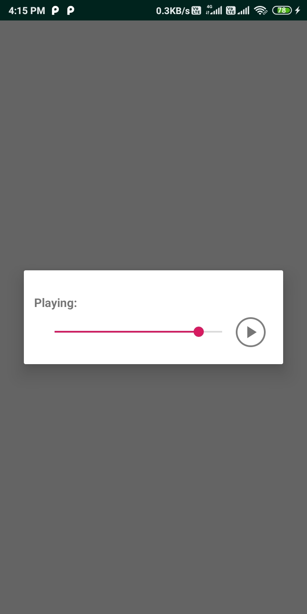

<h1>MediaPlayer</h1>
MediaPlayer is a simple and easy to use library that can be integrated into your project.
The project is build with androidx.
No third party libraries and APIs are used in the project
It is a simple audio player dialog box.
The dialog box support media operations such as play pause and seek
Please follow below instruction to know how to use it in your project

<br/><br/>
<h1>Features</h1>

- Audio file can be played using dialog box<br/>
- Supports two modes viz,<br/>1. `MODE_PATH` - Select file from the android storage by providing filepath<br/>2. `MODE_RESOURCE` - Playing the file on the android resource folder of the project<br/>
- Easy to integrate<br/>
- Supports basic media functions such as play,pause,seek<br/> 

<div style="float:left">


</div>


<br/><br/>

<h1>Getting Started</h1>

**Gradle Integration**<br/>
Add it in your root build.gradle at the end of repositories:
step 1:
```gradle
  allprojects {
		repositories {
			...
			maven { url 'https://jitpack.io' }
		}
	}
```
step 2: Add the dependency
```gradle
  dependencies {
	        implementation 'com.github.shivpujan12:MediaPlayer:0.2'
	}
```
<br/>
Follow below step to use MediaPlayer Library

1) Declare the following things in manifest in AndroidManifest.xml file
- Provide the required permission.

```xml
<uses-permission android:name="android.permission.WRITE_EXTERNAL_STORAGE" />
```

- For getting the audio file from path we need File provider, hence specify the file provider in manifest as shown in below example

```xml
  <application
        android:icon="@mipmap/ic_launcher"
        android:label="@string/app_name"
        android:theme="@style/AppTheme">
        <activity android:name=".MainActivity">
            <intent-filter>
                <action android:name="android.intent.action.MAIN" />
                <category android:name="android.intent.category.LAUNCHER" />
            </intent-filter>
        </activity>
        ....
        ....
       <provider
            android:name="androidx.core.content.FileProvider"
            android:authorities="com.shivtechs.provider"
            android:exported="false"
            android:grantUriPermissions="true">
            <meta-data
                android:name="android.support.FILE_PROVIDER_PATHS"
                android:resource="@xml/provider_paths" />
        </provider>
    </application>
```
- Give the resource for the provider meta-data resource, To do so create provider_paths.xml file inside res/xml/ directory. Below example shows the example meta-data resource file.

```xml
<!--provider_paths.xml-->
  <?xml version="1.0" encoding="utf-8"?>
<paths>
    <external-path path="/" name="MediaPlayer"/>
    <external-cache-path name="cache" path="Pictures" />
</paths>
```

<br/>
<p><b>Note:</b>
Follow the documentation on FileProvider for more details<br/>   https://developer.android.com/training/secure-file-sharing/setup-sharing</p>
   
2) To use the MediaPlayer in your activity add the following code:
- Playing audio using audio filepath

```java
	String FILE_PROVIDER = "com.shivtechs.provider";
	String FILE_PATH = "storage/emulated/0/Download/a.mp3";
	 AudioPlayer player = new AudioPlayer(MainActivity.this,
                        FILE_PROVIDER,
                        isFinishing(),
                        getSupportFragmentManager(),
                        FILE_PATH,
                        MODE_PATH);
```

- Playing audio using android resource file

```java
 AudioPlayer player = new AudioPlayer(MainActivity.this,
                        isFinishing(),
                        getSupportFragmentManager(),
                        R.raw.guitar,
                        MODE_RESOURCE);
```

<br/><br/>

<h1>Bugs and Feedback :thumbsup: :thumbsdown:</h1>
For bugs, questions and discussions please use the Github Issues.
If you like this library please put a star :star: to it
<br/><br/>

<h1>Connect with me!</h1>
<a href="https://twitter.com/Shivpujan120899">
<br>
<a href="https://www.linkedin.com/in/shivpujan-yadav-b98485142">

<br/><br/>
